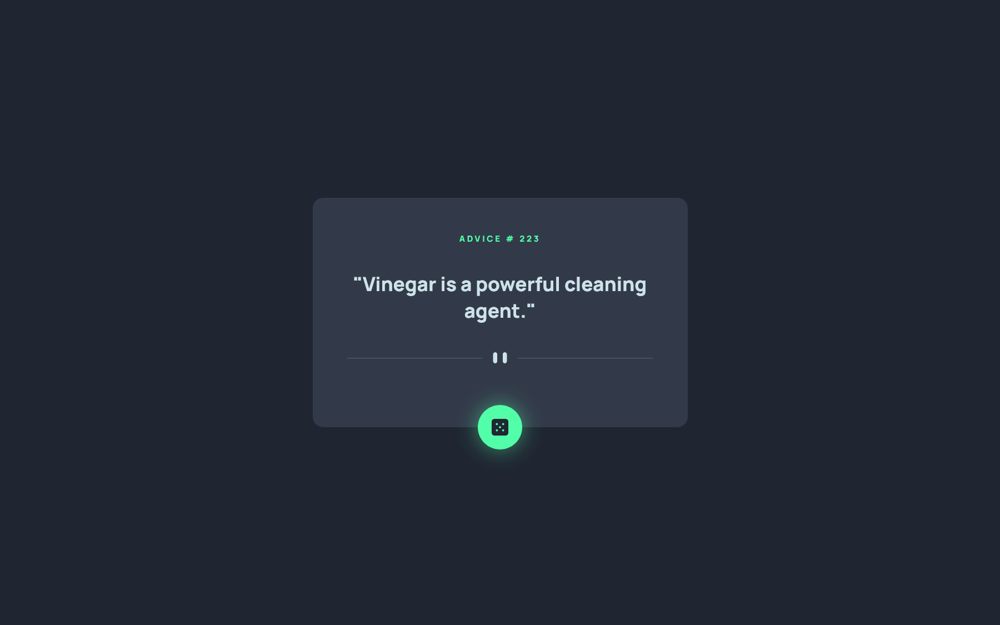
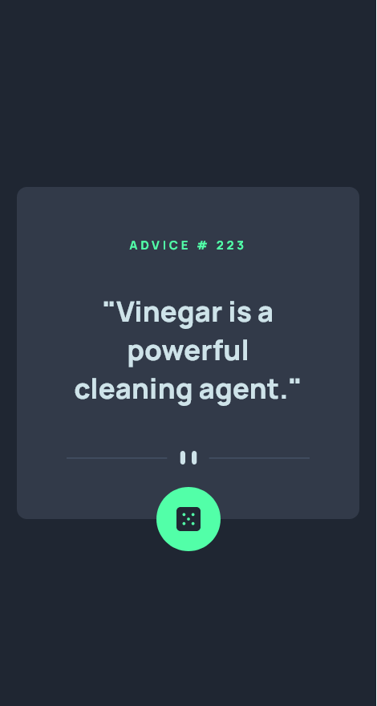

# Frontend Mentor - Advice generator app solution

This is a solution to the [Advice generator app challenge on Frontend Mentor](https://www.frontendmentor.io/challenges/advice-generator-app-QdUG-13db). Frontend Mentor challenges help you improve your coding skills by building realistic projects.

## Table of contents

- [Overview](#overview)
  - [The challenge](#the-challenge)
  - [Screenshot](#screenshot)
- [My process](#my-process)
  - [Built with](#built-with)
  - [What I learned](#what-i-learned)
- [Author](#author)

## Overview

### The challenge

Users should be able to:

- View the optimal layout for the app depending on their device's screen size
- See hover states for all interactive elements on the page
- Generate a new piece of advice by clicking the dice icon

### Screenshot

## My process

### Built with

- Semantic HTML5 markup
- CSS custom properties
- Flexbox
- Mobile-first workflow
- [Vanilla JS](http://vanilla-js.com/) - JavaScript
- [Sass](https://sass-lang.com/) - CSS extension language
- [Vite](https://vitejs.dev/) - Development environment
- [Advice Slip API](https://api.adviceslip.com)

### What I learned

- Fetch API with Vanilla JS
- RWD Layout

## Author

- Website - [Ruo-Fang Wang](https://wang0857.github.io/myWebPortfolios/)
- Frontend Mentor - [Ruo-Fang Wang](https://www.frontendmentor.io/profile/wang0857)
- LinkedIn - [Ruo-Fang Wang](https://ca.linkedin.com/in/ruo-fang-wang-550269226)

